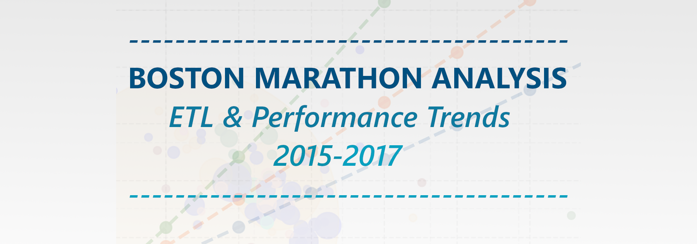
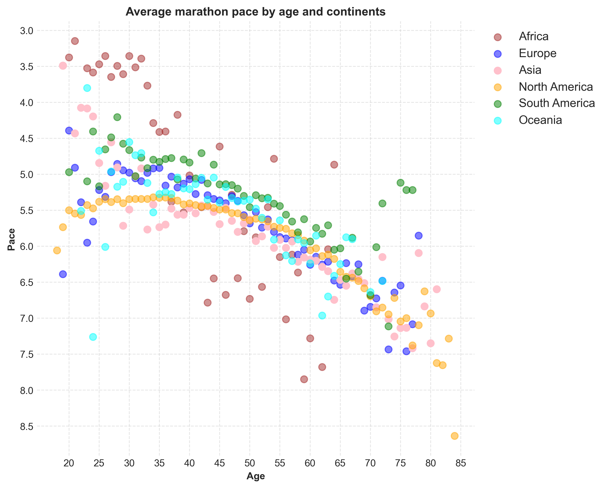
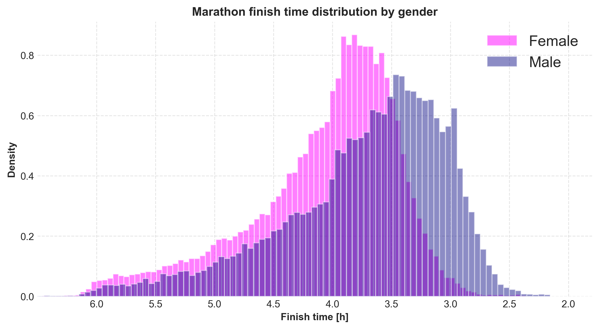

<p align="center">
  
</p>

---
## Summary
This project analyzes Boston Marathon results (2015–2017) to identify performance patterns by gender, age, and ethnicity.

It includes a full data pipeline from cleaning and preprocessing to visualization, built entirely in Python.

> Based on results from 2015, 2016 and 2017
>> Source: [Kaggle – Boston Marathon Results](https://www.kaggle.com/datasets/rojour/boston-results)

---
## Project structure
- [charts/](charts/) - all visualizations generated from notebooks  
- [data/](data/) - all datasets used in the project  
    - [raw/](data/raw) - original datasets downloaded from Kaggle  
    - [clean/](data/clean) - processed datasets used in analysis
    - [mappings/](data/mappings) - additional CSV files used for mapping (e.g., country-to-continent)  
- [notebooks/](notebooks/) - all Jupyter notebooks used in the project  
    - [preparation/](notebooks/preparation) - notebooks for data cleaning, preprocessing, and feature engineering
    - [analysis/](notebooks/analysis) - notebooks containing all analytical work and visualizations
    - [scratch/](notebooks/scratch) - temporary notebooks for testing and experimentation  
- [scripts/](scripts/) - helper Python scripts e.g. color mappings 
- [Visualization_Overview](Visualization_Overview.pdf) - PDF report containing all created charts

---
## Example charts



---
## Technologies
- Python 3.12
- pandas
- numpy
- matplotlib
- seaborn
- Jupyter Notebook

---
## How to run visualizations yourself
### 1. Install required packages:
```bash
pip install -r requirements.txt
```
### 2. Open Jupyter in analysis directory:
```bash
jupyter notebook notebooks/analysis
```
### 3. Choose a notebook and run it.
>Each notebook is independent and can be executed on its own.
